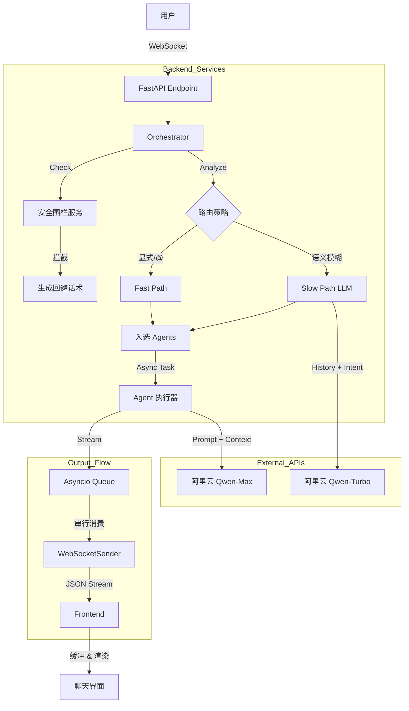

# VividCrowd

> **基于 LLM 的高仿真沉浸式拟人群聊环境**

[](https://opensource.org/licenses/MIT)
[](https://www.python.org/downloads/)
[](https://fastapi.tiangolo.com/)
[](https://react.dev/)

[English Version](README_EN.md)

**VividCrowd** 是一个致力于构建“活”的群聊环境的开源项目。在这里，你是唯一的真人，其余群友均为由 **Qwen-Max** 大模型驱动的 AI Agent。

与传统的“一问一答”机器人不同，本项目通过复杂的**编排算法**和**拟人化策略**，模拟了真实的社交直觉：群友们有自己的作息，懂得上文下达，会因为专业领域不同而主动接话或拒绝回答，甚至会在你输入时显示“对方正在输入...”，并像真人一样整段发送消息。

https://github.com/GISER-KING/VividCrowd/issues/1

---

## 🌟 核心功能 (Core Features)

### 1. 🎭 深度拟人化 Agent (The "Soul")

每个群友都基于 `agents_profiles.json` 定义，拥有独立的灵魂：

* **严格人设模式 (Strict Persona)**：开启后，Agent 会严格遵守人设。例如，**中医学生**绝不会回答**Python代码**问题，而是会打岔说“这题超纲了”。
* **反 AI 助手指令**：通过 System Prompt 注入，强制 Agent 忘记 AI 身份，禁止使用教科书式的说教语气，使用口语化表达。
* **每日消息限制**：Agent 拥有精力限制（如每天最多发 10 条），模拟真人的活跃度，防止麦霸刷屏。

### 2. 🧠 智能混合路由架构 (Hybrid Routing)

采用 **Fast & Slow** 双路径分发机制，兼顾响应速度与语义理解：

* **⚡ Fast Path (规则层 - 毫秒级)**：
  * **显式提及**：识别 `@张遥`，直接锁定目标。
  * **焦点保持 (Focus Retention)**：自动识别上一轮的发言者。如果你正在和小林聊天，下一句即使没指名，系统也会优先让小林回复。
* **🐢 Slow Path (语义层 - 秒级)**：
  * **LLM Router**：当 Fast Path 未命中时，调用轻量级模型（Qwen-Turbo）分析对话历史和用户意图。
  * **场景示例**：用户问“谁能帮我看个代码？”，Router 会分析出这是技术问题，自动派单给程序员“张遥”，而无需用户 @ 他。
* **🎲 氛围与随机 (Ambient & Fallback)**：如果未选中任何特定 Agent，系统会根据概率触发“随机闲聊”（Ambient Chat），保持群内活跃，除非是在深夜。

### 3. 💬 真实群聊体验 (Realistic UX)

* **后台并发，前台串行**：后端多个 Agent 可以同时“思考”和生成，但推送到前端时通过 `asyncio.Queue` 和互斥锁实现**串行发言**，避免两人同时说话的视觉混乱。
* **输入状态模拟**：
  * **Typing Indicator**：Agent 生成回复期间，前端顶部显示“xxx 正在输入...”。
  * **整段发送 (Buffering)**：前端缓冲接收到的流式数据，直到生成完毕才一次性弹出气泡（或大段弹出），完美复刻微信/QQ 的体验。
* **智能去重**：实时检测复读机行为。如果多个 Agent 都想说“我不懂”，系统会自动掐断后续的无效回复。
* **深夜模式 (Night Mode)**：默认深夜 (23:00-07:00) 大幅降低活跃度，模拟群友睡觉。

### 4. 🛡️ 多重安全围栏 (Guardrail)

* **混合检测**：结合正则匹配 (快速) + 上下文分析 + LLM 意图识别 (精准)。
* **防穿帮 (Anti-Break)**：当检测到用户试图通过“扮演”、“你是AI吗”等破防问题时，Agent 不会报错，而是用符合人设的口吻（如“别闹啦”）自然转移话题，维持沉浸感。

---

## 🏗️ 系统架构 (Technical Architecture)

### 设计逻辑

核心理念是 **“体验优于速度”**。我们特意引入了延迟和串行锁，以模拟人类的打字和阅读速度，而不是追求最快的 token 输出。

### 数据流转图



### 目录结构

```bash
VividCrowd/
├── backend/                        # 🐍 Python 后端
│   ├── app/
│   │   ├── core/
│   │   │   └── config.py          # 全局配置 (Key、延迟参数、常量)
│   │   ├── models/                # Pydantic 数据模型
│   │   ├── services/
│   │   │   ├── agent.py           # 单个 Agent 逻辑 (Prompt构建、限流)
│   │   │   ├── guardrail.py       # 安全与防穿帮服务
│   │   │   ├── orchestrator.py    # 核心编排器 (并发控制、队列管理)
│   │   │   └── router.py          # LLM 语义路由服务
│   │   └── main.py                # FastAPI 入口 & WebSocket 路由
│   ├── agents_profiles.json        # 🤖 Agent 人设库
│   └── requirements.txt
├── frontend/                       # ⚛️ React 前端
│   ├── src/
│   │   ├── components/            # UI 组件
│   │   ├── config.js              # 前端配置
│   │   └── App.jsx                # 主应用逻辑 (WS连接、缓冲显示)
│   └── package.json
├── README.md                       # 中文文档
└── README_EN.md                    # English Documentation
```

---

## 🚀 快速启动 (Getting Started)

### 前置要求

* **Python 3.9+**
* **Node.js 16+**
* **阿里云 DashScope API Key** (用于调用通义千问模型)

### 安装与运行

1. **克隆项目**
   
   ```bash
   git clone https://github.com/your-username/VividCrowd.git
   cd VividCrowd
   ```

2. **后端设置**
   
   ```bash
   cd backend
   pip install -r requirements.txt
   
   # 设置 API Key (Windows Powershell)
   $env:DASHSCOPE_API_KEY="your_api_key_here"
   
   # Linux/Mac 用户
   export DASHSCOPE_API_KEY="your_api_key_here"
   
   # 启动服务器
   uvicorn app.main:app --reload
   ```

3. **前端设置** (打开新终端)
   
   ```bash
   cd frontend
   npm install
   npm run dev
   ```

4. **访问**
   浏览器打开 `http://localhost:5173` (或 Vite 显示的端口)。

---

## ⚙️ 配置指南

修改 `backend/app/core/config.py` 可调整仿真参数：

* `STRICT_PERSONA_CHECK`: 开启/关闭严格人设检查。
* `ENABLE_LLM_ROUTING`: 开关 "Slow Path" 语义路由。
* `NIGHT_MODE_START_HOUR`: 设置 Agent 何时入睡。
* `MAX_TYPING_DELAY`: 调整 Agent 发送前的“打字”延迟。

---

## 🤝 参与贡献

欢迎提交 Pull Requests！请确保：

1. Python 代码符合 PEP 8 规范。
2. 新功能包含必要的测试。
3. **不要**提交包含隐私或敏感人设的 `agents_profiles.json`。

---

## 📄 开源协议

本项目基于 [MIT License](LICENSE) 开源。
