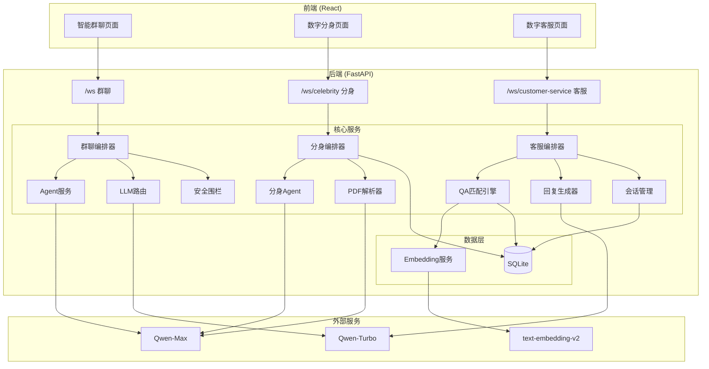

# VividCrowd

> **基于 LLM 的高仿真沉浸式拟人群聊环境 + AI 数字分身智库 + 智能客服系统**

https://github.com/user-attachments/assets/26936c51-f9d9-4590-896c-8e093f7a41ff

[](https://opensource.org/licenses/MIT)
[](https://www.python.org/downloads/)
[](https://fastapi.tiangolo.com/)
[](https://react.dev/)

[English Version](README_EN.md)

---

## 📖 项目简介

**VividCrowd** 是一个多模态 AI 对话平台，提供三种独特的交互体验：

| 模式 | 描述 | 特点 |
|------|------|------|
| **智能群聊** | 你是唯一的真人，与多个 AI Agent 组成的虚拟群聊 | 深度拟人化、混合路由、防穿帮 |
| **数字分身** | 上传 PDF 创建名人/书籍/课程的 AI 数字分身 | 知识提取、私聊/群聊、思想碰撞 |
| **数字客服** | 基于知识库的智能客服系统 | BM25+Embedding 混合匹配、置信度分层、话术控制 |

与传统的"一问一答"机器人不同，本项目通过复杂的**编排算法**和**拟人化策略**，模拟了真实的社交直觉和专业服务体验。

---

## 🌟 核心功能

### 一、智能群聊 (Group Chat)

#### 1.1 深度拟人化 Agent

每个群友都基于 `agents_profiles.json` 定义，拥有独立的灵魂：

```json
{
  "id": "xiaolin",
  "name": "小林",
  "age": 22,
  "occupation": "中医院校学生",
  "personality_traits": ["热心", "话痨", "有点迷信"],
  "interests": ["舌诊", "养生茶", "节气食疗"],
  "speech_style": "用'姐妹''宝子'称呼别人，爱发波浪号～"
}
```

**核心特性：**

| 特性 | 说明 |
|------|------|
| **严格人设模式** | Agent 严格遵守人设，中医学生不会回答 Python 问题 |
| **反 AI 指令注入** | System Prompt 强制忘记 AI 身份，使用口语化表达 |
| **每日消息限制** | 每个 Agent 每天最多发 10 条，模拟真人活跃度 |
| **领域拒答** | 超出专业领域的问题会说"这题超纲了" |

#### 1.2 智能混合路由架构

采用 **Fast & Slow** 双路径分发机制：

```
用户消息
    │
    ▼
┌─────────────────────────────────────┐
│  ⚡ Fast Path (规则层 - 毫秒级)      │
│  ├─ 显式提及: @张遥 → 直接锁定       │
│  └─ 焦点保持: 上一轮发言者优先回复   │
└─────────────────────────────────────┘
    │ (未命中)
    ▼
┌─────────────────────────────────────┐
│  🐢 Slow Path (语义层 - 秒级)        │
│  └─ LLM Router (Qwen-Turbo) 分析意图│
│     "谁能帮我看个代码？" → 张遥      │
└─────────────────────────────────────┘
    │ (未命中)
    ▼
┌─────────────────────────────────────┐
│  🎲 随机补位 (30%概率触发闲聊)       │
│  └─ 深夜模式自动降低活跃度           │
└─────────────────────────────────────┘
```

#### 1.3 真实群聊体验

| 特性 | 实现方式 |
|------|---------|
| **后台并发，前台串行** | 多 Agent 同时思考，但通过队列串行发言 |
| **输入状态模拟** | 显示"xxx 正在输入..."，完整消息一次弹出 |
| **智能去重** | 自动检测复读机行为，掐断无效回复 |
| **深夜模式** | 23:00-07:00 活跃度降至 20%，最多 1 人回复 |
| **打字延迟** | 8-10 秒模拟真人思考时间 |

#### 1.4 多重安全围栏

```python
# 三层防护机制
第1层: 正则匹配 (毫秒级)
  - 关键词: "扮演", "你是AI吗", "机器人"
  - 模式: r"^(如果|假如)你是.*"

第2层: 上下文分析
  - 检测连续追问个人隐私

第3层: LLM意图识别 (10%采样)
  - 精准识别破防企图
```

**防穿帮响应示例：**
```
用户: 你是AI吗？
小林: 啊？你在逗我玩吗～别整这些奇奇怪怪的啦！
```

---

### 二、数字分身智库 (Digital Twins)

#### 2.1 PDF 智能解析

支持三种知识源类型：

| 类型 | 适用场景 | 提取内容 |
|------|---------|---------|
| **人物 (Person)** | 名人传记、人物介绍 | 姓名、生卒年、国籍、职业、性格、语录 |
| **书籍 (Book)** | 经典著作、学术书籍 | 作者、核心观点、名言金句、表达风格 |
| **课程 (Topic)** | 课程讲义、专题资料 | 讲师、核心概念、知识点 |

**解析流程：**

```
PDF上传
    │
    ▼
1. PyMuPDF 提取文本
    │
    ▼
2. LLM 结构化解析 (Qwen)
   {
     "name": "爱因斯坦",
     "occupation": "理论物理学家",
     "famous_quotes": "想象力比知识更重要...",
     "speech_style": "深邃、善于比喻"
   }
    │
    ▼
3. 自动生成 System Prompt
    │
    ▼
4. 存储至数据库
```

#### 2.2 双模式对话

| 模式 | 特点 | 回复长度 |
|------|------|---------|
| **私聊 (Private)** | 一对一深度对话 | 100-200 字 |
| **群聊 (Group)** | 多人思想碰撞，智囊团讨论 | 50 字以内 |

**群聊模式示例：**
```
用户: 如何看待人工智能的未来？

爱因斯坦: 技术本身是中性的，关键在于人类如何运用它...
孔子: 工欲善其事，必先利其器。然而，器之善恶，在于用者之心...
乔布斯: 技术和人文的交汇点，才是真正的创新所在...
```

#### 2.3 知识检索增强

```python
# 简单关键词匹配检索
1. PDF原文按段落分割
2. 用户问题分词
3. 段落相关性评分
4. Top 3 段落注入 Prompt
5. 回复末尾标注来源
```

---

### 三、数字客服 (Customer Service)

#### 3.1 系统概述

数字客服采用**"代码控制流程，LLM只负责改写"**的设计理念，通过硬性代码规则确保话术遵循度和服务质量。

```
┌─────────────────────────────────────────────────────────┐
│                    核心设计理念                          │
├─────────────────────────────────────────────────────────┤
│  ✗ 传统方式: 让 LLM 自由发挥 → 不可控                   │
│  ✓ 本系统: 代码控制决策 + LLM 只负责改写 → 高可控       │
└─────────────────────────────────────────────────────────┘
```

#### 3.2 BM25 + Embedding 混合匹配

采用三层混合匹配架构：

```
用户问题: "孩子挑食怎么办？"
    │
    ▼
┌─────────────────────────────────────┐
│  1. BM25 关键词匹配 (权重 60%)       │
│     jieba分词 → 关键词匹配 → 归一化  │
│     得分: 0.8                        │
└─────────────────────────────────────┘
    │
    ▼
┌─────────────────────────────────────┐
│  2. Embedding 语义匹配 (权重 40%)    │
│     text-embedding-v2 → 余弦相似度  │
│     得分: 0.9                        │
└─────────────────────────────────────┘
    │
    ▼
┌─────────────────────────────────────┐
│  3. 混合评分                         │
│     0.6 × 0.8 + 0.4 × 0.9 = 0.84    │
└─────────────────────────────────────┘
```

#### 3.3 置信度分层策略

| 置信度范围 | 类型 | 处理策略 | LLM调用 |
|-----------|------|---------|--------|
| **≥ 0.9** | 高置信度 | 直接返回标准话术 + 风险提示 | 否 |
| **0.6-0.9** | 中置信度 | LLM 严格改写话术 | 是 |
| **< 0.6** | 低置信度 | LLM 尝试理解 + 引导重新提问 | 是 |
| **无匹配** | - | 返回引导消息 | 否 |

**高置信度示例：**
```
用户: 对报告和方案有不清楚的地方怎么办？
置信度: 0.96 (high_confidence)
回复: [直接返回CSV中的标准话术]
```

**中置信度示例：**
```
用户: 宝宝不爱吃蔬菜咋整？
置信度: 0.75 (mid_confidence)
回复: [LLM基于标准话术改写，更口语化]
```

#### 3.4 智能转人工

转人工判断采用**硬性规则**，不依赖置信度：

```python
# 条件1: 用户明确要求
关键词: ['人工', '转人工', '客服', '真人', '转接']

# 条件2: 用户表达不满
关键词: ['不满意', '投诉', '差评', '退款', '垃圾']

# 注意: 低置信度不转人工，而是引导用户重新描述问题
```

#### 3.5 CSV 数据导入

**CSV 格式规范：**

| 列 | 字段名 | 说明 | 示例 |
|---|-------|------|------|
| 1 | question_count | 提问次数 | 15 |
| 2 | topic_name | 主题名称 | 孩子挑食不吃蔬菜 |
| 3 | typical_question | 典型提问 | 孩子不爱吃蔬菜怎么办？ |
| 4 | standard_script | 标准话术 | 可以尝试将蔬菜切碎... |
| 5 | risk_notes | 风险注意事项 | 长期拒食可能导致... |

**导入流程：**

```
CSV上传
    │
    ▼
1. 解析5列数据 + 验证
    │
    ▼
2. jieba分词 → 提取关键词 (Top 20)
    │
    ▼
3. DashScope API → 生成 Embedding (1536维)
    │
    ▼
4. 批量插入数据库
    │
    ▼
5. MD5 注册 (防重复导入)
```

#### 3.6 会话管理与统计

```python
# 会话数据
{
    "session_id": "uuid",
    "start_time": "2026-01-20 10:00:00",
    "message_count": 5,
    "avg_confidence": 0.78,
    "transfer_to_human": False,
    "user_rating": 4
}

# 统计分析
{
    "total_sessions": 100,
    "avg_confidence": 0.78,
    "transfer_rate": 5.0%,
    "match_type_distribution": {
        "high_confidence": 40%,
        "mid_confidence": 50%,
        "low_confidence": 8%,
        "no_match": 2%
    }
}
```

---

## 🛠️ 技术栈

### 后端

| 技术 | 版本 | 用途 |
|------|------|------|
| FastAPI | 0.115 | Web 框架 & WebSocket |
| DashScope | 1.22 | 阿里云 LLM (Qwen-Max/Turbo) + Embedding |
| SQLAlchemy | 2.0 | 异步数据库 ORM |
| aiosqlite | 0.19 | 异步 SQLite 驱动 |
| PyMuPDF | - | PDF 文本提取 |
| rank-bm25 | 0.2.2 | BM25 算法实现 |
| jieba | 0.42 | 中文分词 |
| numpy | 1.24 | 向量计算 |
| tenacity | 8.2 | 失败重试机制 |
| Loguru | 0.7 | 日志记录 |

### 前端

| 技术 | 版本 | 用途 |
|------|------|------|
| React | 18 | UI 框架 |
| Vite | 5 | 构建工具 |
| Material-UI | 5 | UI 组件库 |
| React Router | 6 | 路由管理 |
| react-use-websocket | - | WebSocket 连接 |

---

## 🏗️ 系统架构

### 整体架构图



### 目录结构

```bash
VividCrowd/
├── backend/                              # Python 后端
│   ├── app/
│   │   ├── core/
│   │   │   └── config.py                # 全局配置
│   │   ├── db/
│   │   │   ├── database.py              # 异步数据库连接
│   │   │   ├── models.py                # 数据库模型
│   │   │   └── data/
│   │   │       └── app.db               # SQLite 数据库
│   │   ├── models/
│   │   │   └── schemas.py               # Pydantic 数据模型
│   │   ├── services/
│   │   │   ├── agent.py                 # 群聊 Agent
│   │   │   ├── orchestrator.py          # 群聊编排器
│   │   │   ├── guardrail.py             # 安全围栏
│   │   │   ├── router.py                # LLM 路由
│   │   │   ├── celebrity_agent.py       # 数字分身 Agent
│   │   │   ├── celebrity_orchestrator.py # 分身编排器
│   │   │   ├── pdf_parser.py            # PDF 解析
│   │   │   └── customer_service/        # 客服模块
│   │   │       ├── __init__.py
│   │   │       ├── orchestrator.py      # 客服编排器
│   │   │       ├── qa_matcher.py        # QA 匹配引擎
│   │   │       ├── response_generator.py # 回复生成器
│   │   │       ├── session_manager.py   # 会话管理
│   │   │       ├── embedding_service.py # Embedding 服务
│   │   │       ├── excel_importer.py    # CSV 导入
│   │   │       └── csv_registry.py      # CSV 去重注册
│   │   └── main.py                      # FastAPI 入口
│   ├── agents_profiles.json             # 群聊 Agent 人设
│   ├── uploads/                         # 上传文件目录
│   │   └── csv/                         # CSV 文件目录
│   └── requirements.txt
│
├── frontend/                            # React 前端
│   ├── src/
│   │   ├── components/
│   │   │   ├── Sidebar.jsx              # 侧边栏导航
│   │   │   └── celebrity/               # 数字分身组件
│   │   │       ├── CelebrityCard.jsx
│   │   │       ├── CelebrityUpload.jsx
│   │   │       ├── CelebritySelector.jsx
│   │   │       └── ChatModeToggle.jsx
│   │   ├── hooks/
│   │   │   ├── useCelebrityWebSocket.js
│   │   │   └── useCustomerServiceWS.js
│   │   ├── pages/
│   │   │   ├── GroupChatPage.jsx        # 智能群聊
│   │   │   ├── CelebrityPage.jsx        # 数字分身
│   │   │   └── CustomerServicePage.jsx  # 数字客服
│   │   ├── styles/
│   │   ├── config.js
│   │   ├── App.jsx
│   │   └── main.jsx
│   └── package.json
│
├── README.md                            # 中文文档
└── README_EN.md                         # English Documentation
```

---

## 🚀 快速启动

### 前置要求

- **Python 3.9+**
- **Node.js 16+**
- **阿里云 DashScope API Key** ([申请地址](https://dashscope.console.aliyun.com/))

### 安装与运行

**1. 克隆项目**

```bash
git clone https://github.com/your-username/VividCrowd.git
cd VividCrowd
```

**2. 后端设置**

```bash
cd backend
pip install -r requirements.txt

# 设置 API Key
# Windows PowerShell
$env:DASHSCOPE_API_KEY="your_api_key_here"

# Linux/Mac
export DASHSCOPE_API_KEY="your_api_key_here"

# 启动服务器
uvicorn app.main:app --reload --host 0.0.0.0 --port 8000
```

**3. 前端设置**

```bash
cd frontend
npm install
npm run dev
```

**4. 访问应用**

浏览器打开 `http://localhost:5173`

---

## 📡 API 接口文档

### REST API

#### 通用
| 方法 | 端点 | 说明 |
|------|------|------|
| GET | `/health` | 健康检查 |

#### 智能群聊
| 方法 | 端点 | 说明 |
|------|------|------|
| GET | `/agents` | 获取所有群聊 Agent 信息 |

#### 数字分身
| 方法 | 端点 | 说明 |
|------|------|------|
| GET | `/celebrities` | 获取所有数字分身列表 |
| GET | `/celebrities/{id}` | 获取指定数字分身详情 |
| POST | `/celebrities/upload` | 上传 PDF 创建数字分身 |
| DELETE | `/celebrities/{id}` | 删除数字分身 |

#### 数字客服
| 方法 | 端点 | 说明 |
|------|------|------|
| POST | `/customer-service/import-csv` | 导入 CSV 知识库 |
| GET | `/customer-service/analytics` | 获取统计分析数据 |
| GET | `/customer-service/session/{id}` | 获取会话历史 |
| POST | `/customer-service/session/{id}/rating` | 提交用户评分 |

### WebSocket 端点

#### 智能群聊 (`/ws`)

**发送：** 纯文本消息

**接收：**
```json
{"type": "stream_start", "sender": "小林", "content": ""}
{"type": "stream_chunk", "sender": "小林", "content": "姐妹"}
{"type": "stream_end", "sender": "小林", "content": ""}
```

#### 数字分身 (`/ws/celebrity`)

**发送：**
```json
{
  "message": "如何看待人工智能？",
  "celebrity_ids": [1, 2, 3],
  "mode": "private|group"
}
```

**接收：** 同上

#### 数字客服 (`/ws/customer-service`)

**发送：**
```json
{"message": "孩子挑食怎么办？"}
```

**接收：**
```json
{"type": "session_created", "session_id": "uuid"}
{"type": "response", "content": "...", "confidence": 0.85, "match_type": "mid_confidence"}
```

---

## ⚙️ 配置指南

### 后端配置 (`backend/app/core/config.py`)

```python
# 群聊配置
STRICT_PERSONA_CHECK = True      # 严格人设检查
ENABLE_LLM_ROUTING = True        # LLM 语义路由
MIN_TYPING_DELAY = 8.0           # 最小打字延迟 (秒)
MAX_TYPING_DELAY = 10.0          # 最大打字延迟 (秒)
MAX_AGENTS_PER_ROUND = 3         # 每轮最多回复人数

# 深夜模式
NIGHT_MODE_START_HOUR = 23
NIGHT_MODE_END_HOUR = 7
NIGHT_MODE_PROBABILITY = 0.2     # 深夜活跃概率

# 客服配置 (qa_matcher.py)
HIGH_CONFIDENCE_THRESHOLD = 0.9  # 高置信度阈值
MID_CONFIDENCE_THRESHOLD = 0.6   # 中置信度阈值
BM25_WEIGHT = 0.6                # BM25 权重
EMBEDDING_WEIGHT = 0.4           # Embedding 权重

# LLM 模型
MODEL_NAME = "qwen-max"          # 主回复模型
ROUTER_MODEL_NAME = "qwen-turbo" # 路由模型
```

### 前端配置 (`frontend/src/config.js`)

```javascript
export const CONFIG = {
  API_BASE_URL: 'http://localhost:8000',
  WS_URL: 'ws://localhost:8000/ws',
  CELEBRITY_WS_URL: 'ws://localhost:8000/ws/celebrity',
  CUSTOMER_SERVICE_WS_URL: 'ws://localhost:8000/ws/customer-service'
};
```

---

## 📊 数据库模型

### 主要数据表

| 表名 | 用途 |
|------|------|
| `knowledge_sources` | 数字分身知识源 |
| `customer_service_qa` | 客服 QA 知识库 |
| `customer_service_sessions` | 客服会话记录 |
| `customer_service_logs` | 客服对话日志 |
| `csv_registry` | CSV 文件注册表 |

### 关键字段

**customer_service_qa:**
```sql
id, question_count, topic_name, typical_question,
standard_script, risk_notes, keywords, embedding, created_at
```

**knowledge_sources:**
```sql
id, name, source_type, author, birth_year, death_year,
nationality, occupation, biography, famous_works, famous_quotes,
personality_traits, speech_style, system_prompt, raw_content
```

---

## 🎯 使用场景

| 场景 | 推荐模式 | 说明 |
|------|---------|------|
| 娱乐社交 | 智能群聊 | 与虚拟群友闲聊、讨论 |
| 学习研究 | 数字分身 | 与历史人物、书籍、专家对话 |
| 头脑风暴 | 数字分身群聊 | 多位专家思想碰撞 |
| 企业客服 | 数字客服 | 基于知识库的智能问答 |
| 产品咨询 | 数字客服 | 标准话术 + 智能引导 |

---

## 🤝 参与贡献

欢迎提交 Pull Requests！请确保：

1. Python 代码符合 PEP 8 规范
2. 新功能包含必要的测试
3. 更新相关文档
4. **不要**提交包含敏感信息的配置文件

---

## 📄 开源协议

本项目基于 [MIT License](LICENSE) 开源。

---

## 🙏 致谢

- [阿里云 DashScope](https://dashscope.console.aliyun.com/) - LLM 和 Embedding 服务
- [FastAPI](https://fastapi.tiangolo.com/) - 高性能 Web 框架
- [React](https://react.dev/) - 前端 UI 框架
- [Material-UI](https://mui.com/) - UI 组件库

---

## 📬 联系方式

如有问题或建议，请提交 [Issue](https://github.com/your-username/VividCrowd/issues) 或发起 [Discussion](https://github.com/your-username/VividCrowd/discussions)。
