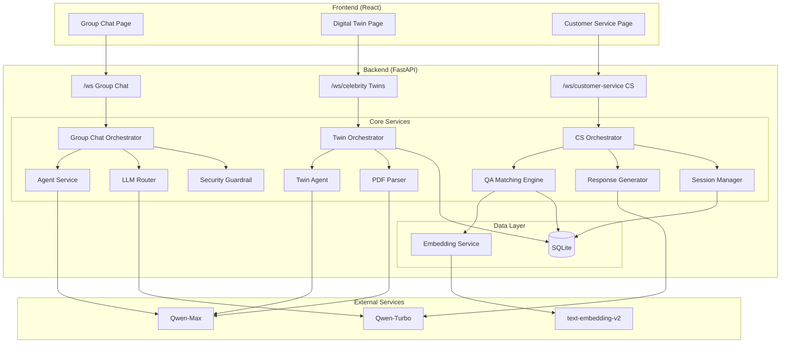

# VividCrowd

> **LLM-Powered Immersive Group Chat Environment + AI Digital Twins + Intelligent Customer Service System**

https://github.com/user-attachments/assets/26936c51-f9d9-4590-896c-8e093f7a41ff

[](https://opensource.org/licenses/MIT)
[](https://www.python.org/downloads/)
[](https://fastapi.tiangolo.com/)
[](https://react.dev/)

[中文版](README.md)

---

## 📖 Overview

**VividCrowd** is a multi-modal AI conversation platform offering three unique interaction experiences:

| Mode | Description | Features |
|------|-------------|----------|
| **Smart Group Chat** | You're the only human in a virtual group chat with multiple AI Agents | Deep persona simulation, hybrid routing, anti-detection |
| **Digital Twins** | Upload PDFs to create AI digital twins of celebrities/books/courses | Knowledge extraction, private/group chat, idea collision |
| **Digital Customer Service** | Knowledge-base powered intelligent customer service system | BM25+Embedding hybrid matching, confidence-based routing, script control |

Unlike traditional "Q&A" bots, this project uses sophisticated **orchestration algorithms** and **humanization strategies** to simulate real social intuition and professional service experiences.

---

## 🌟 Core Features

### 1. Smart Group Chat

#### 1.1 Deep Persona Simulation

Each group member is defined in `agents_profiles.json` with a unique personality:

```json
{
  "id": "xiaolin",
  "name": "Xiaolin",
  "age": 22,
  "occupation": "Traditional Chinese Medicine Student",
  "personality_traits": ["warm-hearted", "talkative", "slightly superstitious"],
  "interests": ["tongue diagnosis", "herbal tea", "seasonal diet"],
  "speech_style": "Uses 'bestie' and 'sweetie', loves tildes~"
}
```

**Core Features:**

| Feature | Description |
|---------|-------------|
| **Strict Persona Mode** | Agents strictly follow their personas; a TCM student won't answer Python questions |
| **Anti-AI Instruction Injection** | System Prompts force agents to forget AI identity, use colloquial expressions |
| **Daily Message Limit** | Each agent sends max 10 messages/day, simulating real activity levels |
| **Domain Rejection** | Out-of-domain questions get "That's beyond me~" responses |

#### 1.2 Intelligent Hybrid Routing

Employs a **Fast & Slow** dual-path dispatch mechanism:

```
User Message
    │
    ▼
┌─────────────────────────────────────┐
│  ⚡ Fast Path (Rule Layer - ms)      │
│  ├─ Explicit mention: @ZhangYao     │
│  └─ Focus retention: prioritize     │
│     previous speaker                │
└─────────────────────────────────────┘
    │ (miss)
    ▼
┌─────────────────────────────────────┐
│  🐢 Slow Path (Semantic Layer - s)   │
│  └─ LLM Router (Qwen-Turbo) analyzes│
│     "Who can help with code?"       │
│     → ZhangYao                      │
└─────────────────────────────────────┘
    │ (miss)
    ▼
┌─────────────────────────────────────┐
│  🎲 Random Fallback (30% chance)    │
│  └─ Night mode reduces activity     │
└─────────────────────────────────────┘
```

#### 1.3 Realistic Chat Experience

| Feature | Implementation |
|---------|---------------|
| **Concurrent backend, serial frontend** | Multiple agents think simultaneously, but speak one at a time via queues |
| **Typing indicators** | Shows "xxx is typing...", messages appear in full |
| **Smart deduplication** | Auto-detects repetitive responses, cuts off redundant replies |
| **Night mode** | 23:00-07:00: 20% activity, max 1 responder |
| **Typing delay** | 8-10 seconds to simulate human thinking |

#### 1.4 Multi-Layer Security Guardrails

```python
# Three-layer protection
Layer 1: Regex matching (milliseconds)
  - Keywords: "roleplay", "are you AI", "robot"
  - Patterns: r"^(if|suppose) you are.*"

Layer 2: Context analysis
  - Detects persistent privacy probing

Layer 3: LLM intent recognition (10% sampling)
  - Precisely identifies jailbreak attempts
```

**Anti-detection response example:**
```
User: Are you an AI?
Xiaolin: Huh? Are you kidding me~ Stop being weird!
```

---

### 2. Digital Twins

#### 2.1 Intelligent PDF Parsing

Supports three knowledge source types:

| Type | Use Case | Extracted Content |
|------|----------|-------------------|
| **Person** | Biographies, profiles | Name, birth/death year, nationality, occupation, personality, quotes |
| **Book** | Classic works, academic books | Author, core ideas, famous quotes, writing style |
| **Topic** | Course materials, topic resources | Instructor, core concepts, knowledge points |

**Parsing Pipeline:**

```
PDF Upload
    │
    ▼
1. PyMuPDF text extraction
    │
    ▼
2. LLM structured parsing (Qwen)
   {
     "name": "Einstein",
     "occupation": "Theoretical Physicist",
     "famous_quotes": "Imagination is more important than knowledge...",
     "speech_style": "Profound, uses metaphors"
   }
    │
    ▼
3. Auto-generate System Prompt
    │
    ▼
4. Store to database
```

#### 2.2 Dual Conversation Modes

| Mode | Features | Response Length |
|------|----------|-----------------|
| **Private** | One-on-one deep conversation | 100-200 words |
| **Group** | Multi-person idea collision, think tank discussion | Under 50 words |

**Group mode example:**
```
User: What's your view on the future of AI?

Einstein: Technology itself is neutral; it depends on how humanity uses it...
Confucius: If you want to do something well, sharpen your tools first. Yet the good or evil of tools lies in the user's heart...
Jobs: The intersection of technology and humanities is where true innovation happens...
```

#### 2.3 Knowledge-Enhanced Retrieval

```python
# Simple keyword matching retrieval
1. Split PDF text into paragraphs
2. Tokenize user question
3. Score paragraph relevance
4. Inject top 3 paragraphs into prompt
5. Cite sources at response end
```

---

### 3. Digital Customer Service

#### 3.1 System Overview

Digital Customer Service adopts the philosophy of **"Code controls flow, LLM only rewrites"**, using hard-coded rules to ensure script compliance and service quality.

```
┌─────────────────────────────────────────────────────────┐
│                    Core Design Philosophy                │
├─────────────────────────────────────────────────────────┤
│  ✗ Traditional: Let LLM improvise → Uncontrollable     │
│  ✓ This system: Code controls decisions + LLM rewrites │
│    → Highly controllable                                │
└─────────────────────────────────────────────────────────┘
```

#### 3.2 BM25 + Embedding Hybrid Matching

Three-layer hybrid matching architecture:

```
User Question: "What if my child is picky?"
    │
    ▼
┌─────────────────────────────────────┐
│  1. BM25 Keyword Matching (60%)      │
│     jieba tokenization → match       │
│     → normalize                      │
│     Score: 0.8                       │
└─────────────────────────────────────┘
    │
    ▼
┌─────────────────────────────────────┐
│  2. Embedding Semantic Match (40%)   │
│     text-embedding-v2 → cosine sim   │
│     Score: 0.9                       │
└─────────────────────────────────────┘
    │
    ▼
┌─────────────────────────────────────┐
│  3. Hybrid Score                     │
│     0.6 × 0.8 + 0.4 × 0.9 = 0.84    │
└─────────────────────────────────────┘
```

#### 3.3 Confidence-Based Routing Strategy

| Confidence Range | Type | Strategy | LLM Call |
|-----------------|------|----------|----------|
| **≥ 0.9** | High | Return standard script + risk notes directly | No |
| **0.6-0.9** | Medium | LLM strictly rewrites script | Yes |
| **< 0.6** | Low | LLM attempts understanding + guides rephrasing | Yes |
| **No match** | - | Return guidance message | No |

**High confidence example:**
```
User: What if I don't understand the report?
Confidence: 0.96 (high_confidence)
Response: [Returns CSV standard script directly]
```

**Medium confidence example:**
```
User: My baby doesn't like veggies, what do?
Confidence: 0.75 (mid_confidence)
Response: [LLM rewrites based on script, more colloquial]
```

#### 3.4 Smart Human Handoff

Human handoff uses **hard rules**, not confidence:

```python
# Condition 1: User explicit request
Keywords: ['human', 'transfer', 'agent', 'real person']

# Condition 2: User dissatisfaction
Keywords: ['unsatisfied', 'complaint', 'refund', 'terrible']

# Note: Low confidence doesn't trigger handoff - guides user to rephrase instead
```

#### 3.5 CSV Data Import

**CSV Format Specification:**

| Column | Field | Description | Example |
|--------|-------|-------------|---------|
| 1 | question_count | Query frequency | 15 |
| 2 | topic_name | Topic name | Child picky eating |
| 3 | typical_question | Typical question | What if child won't eat vegetables? |
| 4 | standard_script | Standard script | Try cutting vegetables smaller... |
| 5 | risk_notes | Risk notes | Long-term refusal may cause... |

**Import Pipeline:**

```
CSV Upload
    │
    ▼
1. Parse 5 columns + validate
    │
    ▼
2. jieba tokenization → extract keywords (Top 20)
    │
    ▼
3. DashScope API → generate Embedding (1536-dim)
    │
    ▼
4. Batch insert to database
    │
    ▼
5. MD5 registration (prevent duplicate imports)
```

#### 3.6 Session Management & Analytics

```python
# Session data
{
    "session_id": "uuid",
    "start_time": "2026-01-20 10:00:00",
    "message_count": 5,
    "avg_confidence": 0.78,
    "transfer_to_human": False,
    "user_rating": 4
}

# Analytics
{
    "total_sessions": 100,
    "avg_confidence": 0.78,
    "transfer_rate": 5.0%,
    "match_type_distribution": {
        "high_confidence": 40%,
        "mid_confidence": 50%,
        "low_confidence": 8%,
        "no_match": 2%
    }
}
```

---

## 🛠️ Tech Stack

### Backend

| Technology | Version | Purpose |
|------------|---------|---------|
| FastAPI | 0.115 | Web framework & WebSocket |
| DashScope | 1.22 | Alibaba Cloud LLM (Qwen-Max/Turbo) + Embedding |
| SQLAlchemy | 2.0 | Async database ORM |
| aiosqlite | 0.19 | Async SQLite driver |
| PyMuPDF | - | PDF text extraction |
| rank-bm25 | 0.2.2 | BM25 algorithm implementation |
| jieba | 0.42 | Chinese tokenization |
| numpy | 1.24 | Vector computation |
| tenacity | 8.2 | Retry mechanism |
| Loguru | 0.7 | Logging |

### Frontend

| Technology | Version | Purpose |
|------------|---------|---------|
| React | 18 | UI framework |
| Vite | 5 | Build tool |
| Material-UI | 5 | UI component library |
| React Router | 6 | Routing |
| react-use-websocket | - | WebSocket connection |

---

## 🏗️ Architecture

### System Architecture Diagram



### Directory Structure

```bash
VividCrowd/
├── backend/                              # Python Backend
│   ├── app/
│   │   ├── core/
│   │   │   └── config.py                # Global configuration
│   │   ├── db/
│   │   │   ├── database.py              # Async database connection
│   │   │   ├── models.py                # Database models
│   │   │   └── data/
│   │   │       └── app.db               # SQLite database
│   │   ├── models/
│   │   │   └── schemas.py               # Pydantic data models
│   │   ├── services/
│   │   │   ├── agent.py                 # Group Chat Agent
│   │   │   ├── orchestrator.py          # Group Chat Orchestrator
│   │   │   ├── guardrail.py             # Security Guardrail
│   │   │   ├── router.py                # LLM Router
│   │   │   ├── celebrity_agent.py       # Digital Twin Agent
│   │   │   ├── celebrity_orchestrator.py # Twin Orchestrator
│   │   │   ├── pdf_parser.py            # PDF Parser
│   │   │   └── customer_service/        # Customer Service Module
│   │   │       ├── __init__.py
│   │   │       ├── orchestrator.py      # CS Orchestrator
│   │   │       ├── qa_matcher.py        # QA Matching Engine
│   │   │       ├── response_generator.py # Response Generator
│   │   │       ├── session_manager.py   # Session Manager
│   │   │       ├── embedding_service.py # Embedding Service
│   │   │       ├── excel_importer.py    # CSV Importer
│   │   │       └── csv_registry.py      # CSV Dedup Registry
│   │   └── main.py                      # FastAPI entry point
│   ├── agents_profiles.json             # Group Chat Agent personas
│   ├── uploads/                         # Upload directory
│   │   └── csv/                         # CSV files directory
│   └── requirements.txt
│
├── frontend/                            # React Frontend
│   ├── src/
│   │   ├── components/
│   │   │   ├── Sidebar.jsx              # Sidebar navigation
│   │   │   └── celebrity/               # Digital Twin components
│   │   │       ├── CelebrityCard.jsx
│   │   │       ├── CelebrityUpload.jsx
│   │   │       ├── CelebritySelector.jsx
│   │   │       └── ChatModeToggle.jsx
│   │   ├── hooks/
│   │   │   ├── useCelebrityWebSocket.js
│   │   │   └── useCustomerServiceWS.js
│   │   ├── pages/
│   │   │   ├── GroupChatPage.jsx        # Smart Group Chat
│   │   │   ├── CelebrityPage.jsx        # Digital Twins
│   │   │   └── CustomerServicePage.jsx  # Customer Service
│   │   ├── styles/
│   │   ├── config.js
│   │   ├── App.jsx
│   │   └── main.jsx
│   └── package.json
│
├── README.md                            # Chinese Documentation
└── README_EN.md                         # English Documentation
```

---

## 🚀 Quick Start

### Prerequisites

- **Python 3.9+**
- **Node.js 16+**
- **Alibaba Cloud DashScope API Key** ([Apply here](https://dashscope.console.aliyun.com/))

### Installation & Running

**1. Clone the project**

```bash
git clone https://github.com/your-username/VividCrowd.git
cd VividCrowd
```

**2. Backend setup**

```bash
cd backend
pip install -r requirements.txt

# Set API Key
# Windows PowerShell
$env:DASHSCOPE_API_KEY="your_api_key_here"

# Linux/Mac
export DASHSCOPE_API_KEY="your_api_key_here"

# Start server
uvicorn app.main:app --reload --host 0.0.0.0 --port 8000
```

**3. Frontend setup**

```bash
cd frontend
npm install
npm run dev
```

**4. Access the application**

Open browser at `http://localhost:5173`

---

## 📡 API Documentation

### REST API

#### General
| Method | Endpoint | Description |
|--------|----------|-------------|
| GET | `/health` | Health check |

#### Smart Group Chat
| Method | Endpoint | Description |
|--------|----------|-------------|
| GET | `/agents` | Get all group chat agent info |

#### Digital Twins
| Method | Endpoint | Description |
|--------|----------|-------------|
| GET | `/celebrities` | Get all digital twins |
| GET | `/celebrities/{id}` | Get specific twin details |
| POST | `/celebrities/upload` | Upload PDF to create twin |
| DELETE | `/celebrities/{id}` | Delete digital twin |

#### Customer Service
| Method | Endpoint | Description |
|--------|----------|-------------|
| POST | `/customer-service/import-csv` | Import CSV knowledge base |
| GET | `/customer-service/analytics` | Get analytics data |
| GET | `/customer-service/session/{id}` | Get session history |
| POST | `/customer-service/session/{id}/rating` | Submit user rating |

### WebSocket Endpoints

#### Smart Group Chat (`/ws`)

**Send:** Plain text message

**Receive:**
```json
{"type": "stream_start", "sender": "Xiaolin", "content": ""}
{"type": "stream_chunk", "sender": "Xiaolin", "content": "Hey"}
{"type": "stream_end", "sender": "Xiaolin", "content": ""}
```

#### Digital Twins (`/ws/celebrity`)

**Send:**
```json
{
  "message": "What's your view on AI?",
  "celebrity_ids": [1, 2, 3],
  "mode": "private|group"
}
```

**Receive:** Same as above

#### Customer Service (`/ws/customer-service`)

**Send:**
```json
{"message": "What if my child is picky?"}
```

**Receive:**
```json
{"type": "session_created", "session_id": "uuid"}
{"type": "response", "content": "...", "confidence": 0.85, "match_type": "mid_confidence"}
```

---

## ⚙️ Configuration

### Backend Config (`backend/app/core/config.py`)

```python
# Group Chat Config
STRICT_PERSONA_CHECK = True      # Strict persona checking
ENABLE_LLM_ROUTING = True        # LLM semantic routing
MIN_TYPING_DELAY = 8.0           # Min typing delay (seconds)
MAX_TYPING_DELAY = 10.0          # Max typing delay (seconds)
MAX_AGENTS_PER_ROUND = 3         # Max responders per round

# Night Mode
NIGHT_MODE_START_HOUR = 23
NIGHT_MODE_END_HOUR = 7
NIGHT_MODE_PROBABILITY = 0.2     # Night activity probability

# Customer Service Config (qa_matcher.py)
HIGH_CONFIDENCE_THRESHOLD = 0.9  # High confidence threshold
MID_CONFIDENCE_THRESHOLD = 0.6   # Medium confidence threshold
BM25_WEIGHT = 0.6                # BM25 weight
EMBEDDING_WEIGHT = 0.4           # Embedding weight

# LLM Models
MODEL_NAME = "qwen-max"          # Main response model
ROUTER_MODEL_NAME = "qwen-turbo" # Router model
```

### Frontend Config (`frontend/src/config.js`)

```javascript
export const CONFIG = {
  API_BASE_URL: 'http://localhost:8000',
  WS_URL: 'ws://localhost:8000/ws',
  CELEBRITY_WS_URL: 'ws://localhost:8000/ws/celebrity',
  CUSTOMER_SERVICE_WS_URL: 'ws://localhost:8000/ws/customer-service'
};
```

---

## 📊 Database Models

### Main Tables

| Table Name | Purpose |
|------------|---------|
| `knowledge_sources` | Digital twin knowledge sources |
| `customer_service_qa` | Customer service QA knowledge base |
| `customer_service_sessions` | Customer service session records |
| `customer_service_logs` | Customer service conversation logs |
| `csv_registry` | CSV file registry |

### Key Fields

**customer_service_qa:**
```sql
id, question_count, topic_name, typical_question,
standard_script, risk_notes, keywords, embedding, created_at
```

**knowledge_sources:**
```sql
id, name, source_type, author, birth_year, death_year,
nationality, occupation, biography, famous_works, famous_quotes,
personality_traits, speech_style, system_prompt, raw_content
```

---

## 🎯 Use Cases

| Scenario | Recommended Mode | Description |
|----------|-----------------|-------------|
| Entertainment | Smart Group Chat | Chat casually with virtual friends |
| Learning | Digital Twins | Converse with historical figures, books, experts |
| Brainstorming | Twin Group Chat | Multiple experts' idea collision |
| Enterprise CS | Customer Service | Knowledge-base powered Q&A |
| Product Consulting | Customer Service | Standard scripts + smart guidance |

---

## 🤝 Contributing

Pull Requests welcome! Please ensure:

1. Python code follows PEP 8 standards
2. New features include necessary tests
3. Update relevant documentation
4. **Do not** commit config files with sensitive information

---

## 📄 License

This project is open-sourced under the [MIT License](LICENSE).

---

## 🙏 Acknowledgments

- [Alibaba Cloud DashScope](https://dashscope.console.aliyun.com/) - LLM and Embedding services
- [FastAPI](https://fastapi.tiangolo.com/) - High-performance web framework
- [React](https://react.dev/) - Frontend UI framework
- [Material-UI](https://mui.com/) - UI component library

---

## 📬 Contact

For questions or suggestions, please submit an [Issue](https://github.com/your-username/VividCrowd/issues) or start a [Discussion](https://github.com/your-username/VividCrowd/discussions).
