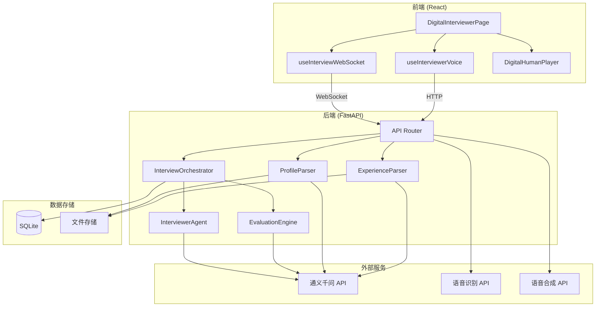
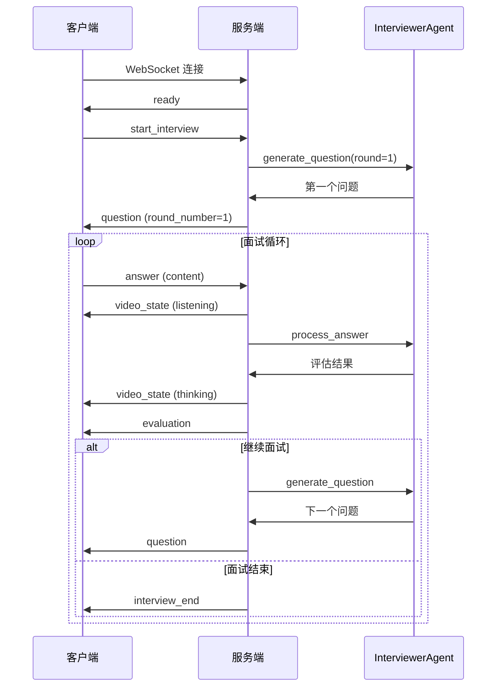
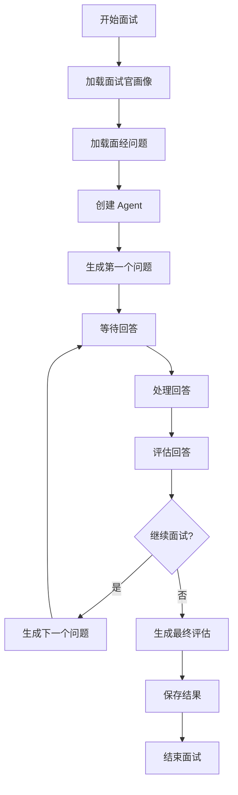
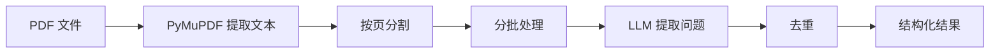
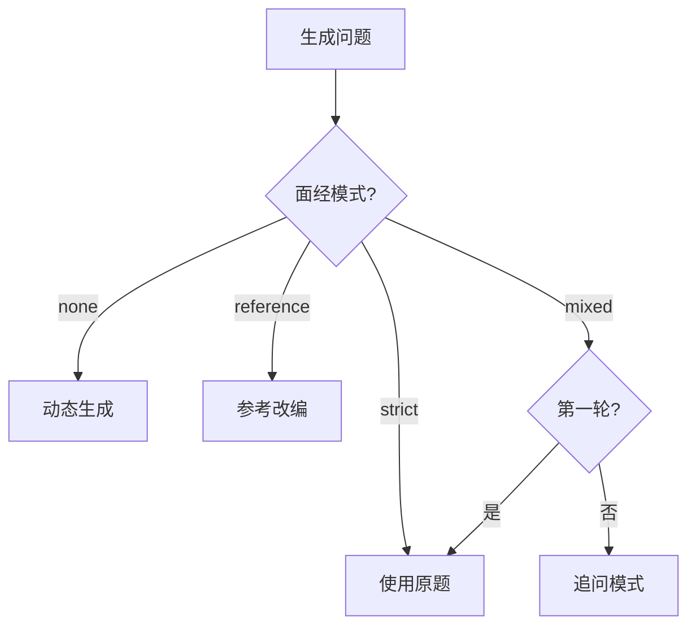
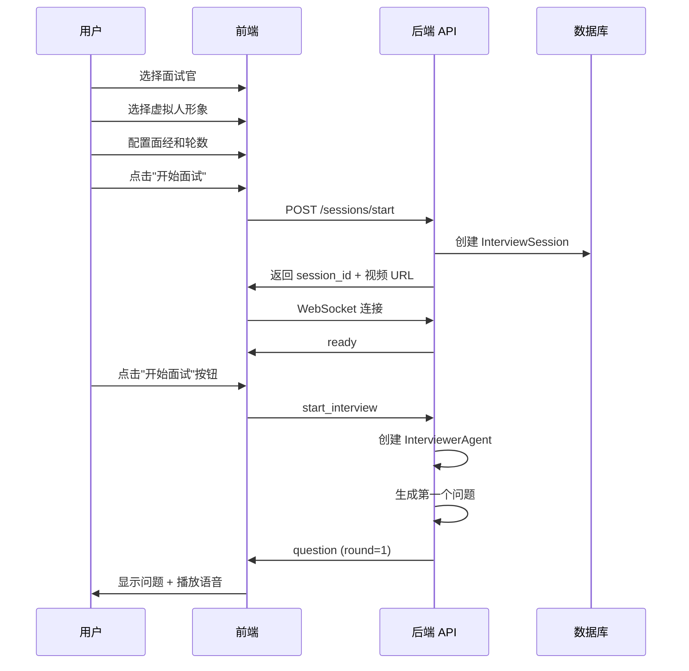
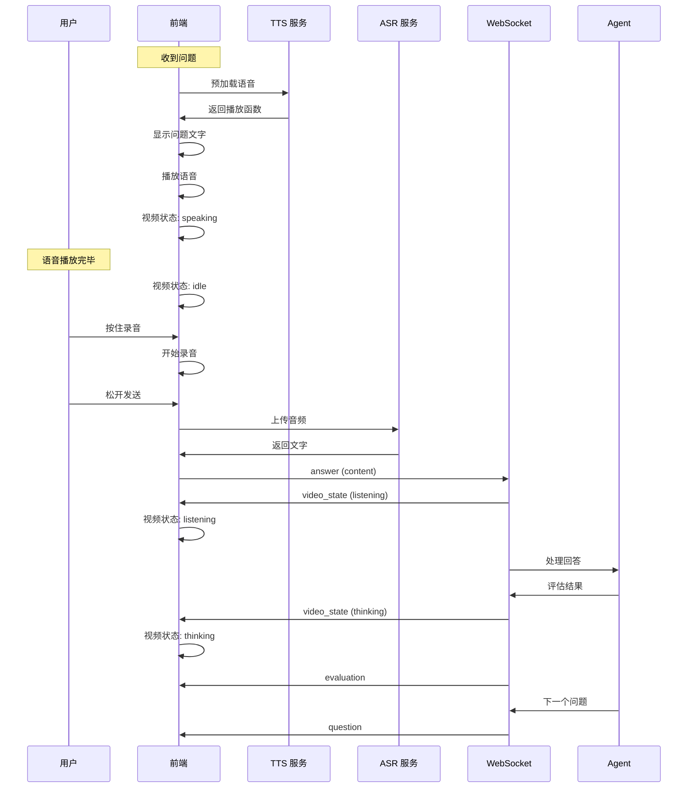
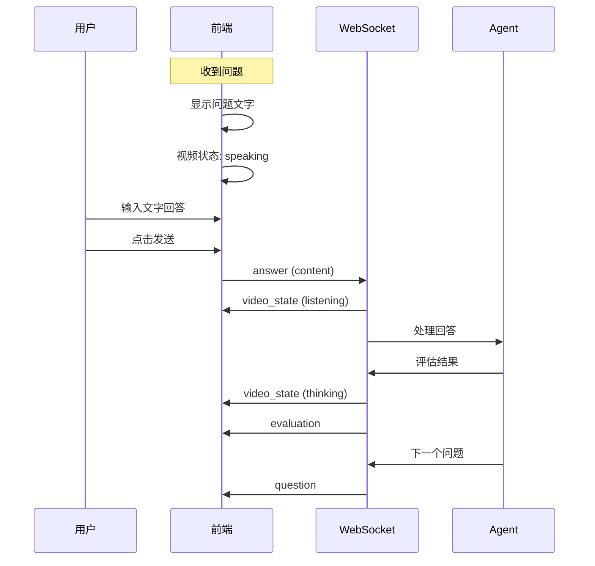
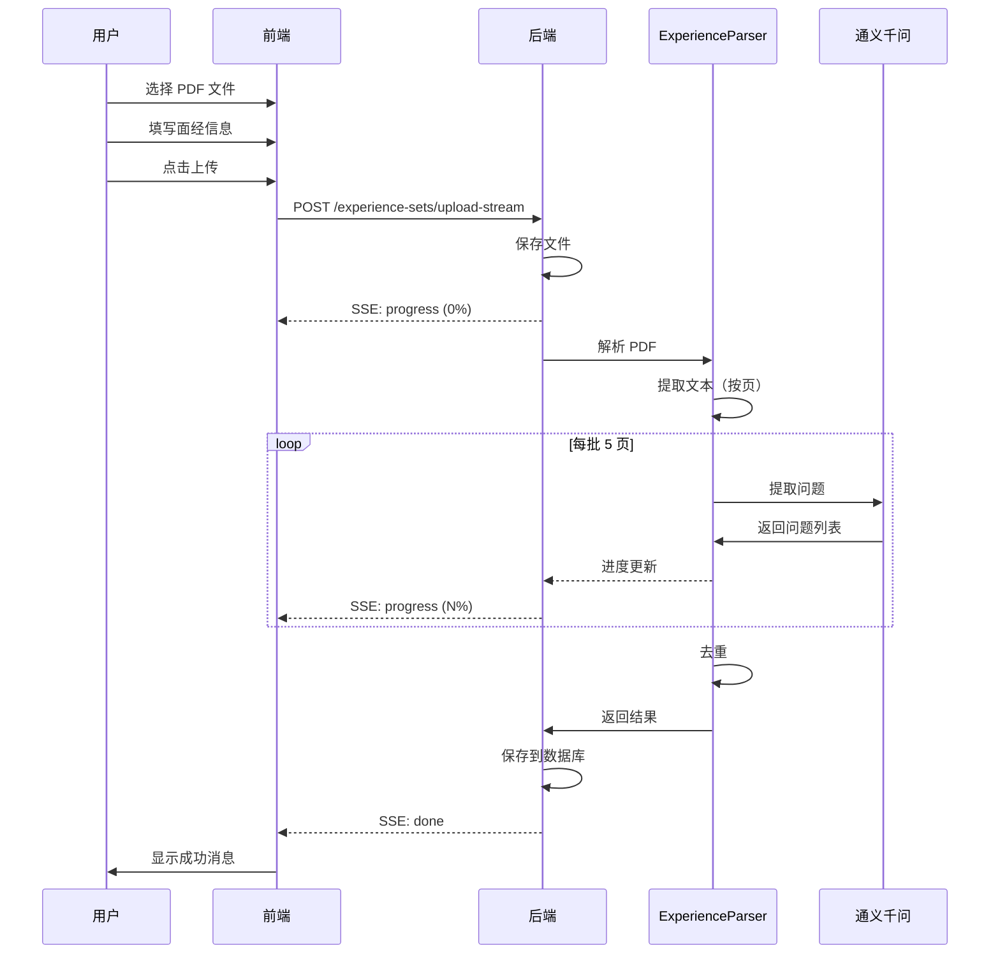
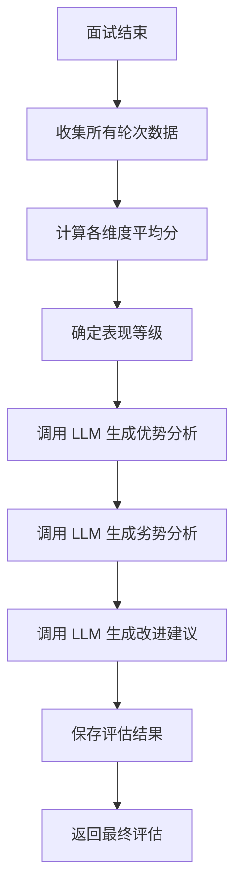

# 数字面试官系统技术文档

## 1. 系统概述

### 1.1 产品简介

数字面试官是 VividCrowd 平台的核心模块之一，提供 AI 驱动的智能面试训练服务。系统通过虚拟人形象、语音交互和实时评估，为用户提供沉浸式的面试模拟体验。

### 1.2 核心功能

- **面试官画像管理**：上传 PDF/Markdown 格式的面试官画像，自动解析生成 AI 面试官
- **虚拟人形象**：支持多种虚拟人形象，包含说话、倾听、思考等多种状态视频
- **实时面试对话**：基于 WebSocket 的实时问答交互
- **语音交互**：支持 ASR（语音识别）和 TTS（语音合成）
- **面经库管理**：上传 PDF 面经，自动提取面试问题
- **多维度评估**：技术能力、沟通表达、问题解决、文化匹配四维评估
- **面试报告**：生成详细的面试评估报告，支持 PDF 导出

### 1.3 技术栈

| 层级 | 技术选型 |
|------|----------|
| 后端框架 | FastAPI + SQLAlchemy |
| 数据库 | SQLite |
| AI 模型 | 通义千问 (qwen-max) |
| 语音服务 | 阿里云 DashScope ASR/TTS |
| 前端框架 | React + Material-UI |
| 实时通信 | WebSocket |
| PDF 处理 | PyMuPDF + WeasyPrint |

### 1.4 系统架构图



---

## 2. 目录结构

### 2.1 后端目录结构

```
backend/
├── apps/
│   └── digital_interviewer/
│       ├── __init__.py
│       ├── app.py                    # API 路由定义
│       └── services/
│           ├── __init__.py
│           ├── interviewer_orchestrator.py  # 面试编排器
│           ├── profile_parser.py            # 画像解析器
│           ├── evaluation_engine.py         # 评估引擎
│           ├── experience_parser.py         # 面经解析器
│           └── experience_service.py        # 面经服务
├── agents/
│   └── interviewer_agent.py          # 面试官 Agent
├── models/
│   └── db_models.py                  # 数据模型定义
├── core/
│   ├── database.py                   # 数据库连接
│   └── config.py                     # 配置管理
└── data/
    ├── digital_interviewer.db        # SQLite 数据库
    ├── digital_humans/               # 虚拟人形象视频
    └── interviewer_uploads/
        ├── profiles/                 # 面试官画像文件
        └── experiences/              # 面经 PDF 文件
```

### 2.2 前端目录结构

```
frontend/src/
├── pages/
│   ├── DigitalInterviewerPage.jsx    # 主页面
│   └── InterviewReportPage.jsx       # 报告页面
├── components/
│   └── digital_interviewer/
│       ├── InterviewerCard.jsx       # 面试官卡片
│       ├── InterviewerUpload.jsx     # 画像上传
│       ├── DigitalHumanPlayer.jsx    # 虚拟人播放器
│       ├── InterviewChat.jsx         # 对话组件
│       ├── VoiceInterviewInput.jsx   # 语音输入
│       └── InterviewFeedback.jsx     # 反馈组件
├── hooks/
│   ├── useInterviewWebSocket.js      # WebSocket Hook
│   └── useInterviewerVoice.js        # 语音 Hook
└── styles/
    └── interviewerTheme.js           # 主题样式
```

### 2.3 数据存储目录

```
backend/data/
├── digital_interviewer.db            # 主数据库
├── digital_humans/                   # 虚拟人形象库
│   └── {human_name}/
│       ├── idle.mp4                  # 空闲状态
│       ├── speaking.mp4              # 说话状态
│       ├── listening.mp4             # 倾听状态
│       └── thinking.mp4              # 思考状态
├── interviewer_uploads/
│   ├── profiles/                     # 面试官画像
│   │   └── *.pdf / *.md
│   └── experiences/                  # 面经文件
│       └── *.pdf
└── interviewer_examples/             # 示例文件
```

---

## 3. 数据模型

### 3.1 InterviewerProfile（面试官画像）

存储面试官的结构化信息和 AI 系统提示词。

```python
class InterviewerProfile(Base):
    __tablename__ = "interviewer_profiles"

    id = Column(Integer, primary_key=True)
    name = Column(String(100), nullable=False)           # 面试官姓名
    title = Column(String(100))                          # 职位
    company = Column(String(100))                        # 公司
    expertise_areas = Column(Text)                       # 专业领域
    interview_style = Column(Text)                       # 面试风格
    personality_traits = Column(Text)                    # 性格特征
    question_preferences = Column(Text)                  # 问题偏好
    system_prompt = Column(Text)                         # AI 系统提示词
    raw_content = Column(Text)                           # 原始文件内容
    source_file_path = Column(String(500))               # 源文件路径
    created_at = Column(DateTime)
    updated_at = Column(DateTime)
```

### 3.2 InterviewerProfileRegistry（画像注册表）

记录已导入的画像文件，通过文件哈希避免重复导入。

```python
class InterviewerProfileRegistry(Base):
    __tablename__ = "interviewer_profile_registry"

    id = Column(Integer, primary_key=True)
    filename = Column(String(255), unique=True)          # 文件名
    file_hash = Column(String(64))                       # MD5 哈希
    interviewer_profile_id = Column(Integer)             # 关联的画像 ID
    interviewer_name = Column(String(100))               # 面试官姓名
    status = Column(String(20), default="success")       # 导入状态
    imported_at = Column(DateTime)
```

### 3.3 DigitalHuman（虚拟人形象）

存储虚拟人形象的视频路径和元数据。

```python
class DigitalHuman(Base):
    __tablename__ = "digital_humans"

    id = Column(Integer, primary_key=True)
    name = Column(String(100), unique=True)              # 形象名称（文件夹名）
    display_name = Column(String(100))                   # 显示名称
    description = Column(String(500))                    # 描述
    gender = Column(String(20))                          # 性别
    style = Column(String(50))                           # 风格
    video_idle = Column(String(500))                     # 空闲视频路径
    video_speaking = Column(String(500))                 # 说话视频路径
    video_listening = Column(String(500))                # 倾听视频路径
    video_thinking = Column(String(500))                 # 思考视频路径
    is_active = Column(Boolean, default=True)            # 是否启用
    is_default = Column(Boolean, default=False)          # 是否默认
    created_at = Column(DateTime)
    updated_at = Column(DateTime)
```

### 3.4 InterviewSession（面试会话）

记录每次面试的完整过程。

```python
class InterviewSession(Base):
    __tablename__ = "interview_sessions"

    id = Column(Integer, primary_key=True)
    session_id = Column(String(64), unique=True)         # UUID 会话标识
    candidate_id = Column(String(100))                   # 候选人 ID
    candidate_name = Column(String(100))                 # 候选人姓名
    interviewer_profile_id = Column(Integer, ForeignKey) # 面试官 ID
    digital_human_id = Column(Integer, ForeignKey)       # 虚拟人形象 ID
    interviewer_name = Column(String(100))               # 面试官姓名（冗余）
    interviewer_title = Column(String(100))              # 面试官职位（冗余）
    interview_type = Column(String(50))                  # 面试类型
    difficulty_level = Column(String(20))                # 难度级别
    max_rounds = Column(Integer, default=5)              # 最大轮数
    current_round = Column(Integer, default=0)           # 当前轮次
    total_rounds = Column(Integer, default=0)            # 总轮次
    status = Column(String(20), default="in_progress")   # 状态
    started_at = Column(DateTime)
    completed_at = Column(DateTime)
    duration_seconds = Column(Integer)                   # 持续时间（秒）
    created_at = Column(DateTime)
    updated_at = Column(DateTime)
```

**面试类型 (interview_type)**：
- `technical` - 技术面试
- `hr` - HR 面试
- `behavioral` - 行为面试

**会话状态 (status)**：
- `in_progress` - 进行中
- `completed` - 已完成
- `abandoned` - 已放弃

### 3.5 InterviewRound（面试轮次）

记录每一轮问答的详细信息。

```python
class InterviewRound(Base):
    __tablename__ = "interview_rounds"

    id = Column(Integer, primary_key=True)
    session_id = Column(Integer, ForeignKey)             # 会话 ID
    round_number = Column(Integer)                       # 轮次编号
    question = Column(Text)                              # 问题内容
    answer = Column(Text)                                # 回答内容
    question_type = Column(String(50))                   # 问题类型
    is_followup = Column(Boolean, default=False)         # 是否追问
    answer_quality = Column(String(50))                  # 回答质量
    evaluation_data = Column(JSON)                       # 评估数据
    timestamp = Column(DateTime)
```

**评估数据结构 (evaluation_data)**：
```json
{
    "technical_score": 8,
    "communication_score": 7,
    "problem_solving_score": 8,
    "cultural_fit_score": 7,
    "quality": "good",
    "should_followup": false,
    "followup_reason": ""
}
```

### 3.6 InterviewEvaluation（面试评估）

存储面试的综合评估结果。

```python
class InterviewEvaluation(Base):
    __tablename__ = "interview_evaluations"

    id = Column(Integer, primary_key=True)
    session_id = Column(Integer, ForeignKey, unique=True)
    technical_score = Column(Integer)                    # 技术能力分 (1-10)
    communication_score = Column(Integer)                # 沟通表达分 (1-10)
    problem_solving_score = Column(Integer)              # 问题解决分 (1-10)
    cultural_fit_score = Column(Integer)                 # 文化匹配分 (1-10)
    total_score = Column(Integer)                        # 总分 (4-40)
    performance_level = Column(String(20))               # 表现等级
    strengths = Column(JSON)                             # 优势列表
    weaknesses = Column(JSON)                            # 劣势列表
    suggestions = Column(JSON)                           # 改进建议
    detailed_report = Column(Text)                       # 详细报告
    created_at = Column(DateTime)
```

**表现等级 (performance_level)**：
- `优秀` - 总分 >= 35
- `良好` - 总分 >= 28
- `合格` - 总分 >= 20
- `待提升` - 总分 < 20

### 3.7 InterviewExperienceSet（面经集）

管理上传的面经文件。

```python
class InterviewExperienceSet(Base):
    __tablename__ = "interview_experience_set"

    id = Column(Integer, primary_key=True)
    name = Column(String(100))                           # 面经集名称
    description = Column(Text)                           # 描述
    source_filename = Column(String(255))                # 原始文件名
    company = Column(String(100))                        # 目标公司
    position = Column(String(100))                       # 目标职位
    interview_type = Column(String(50))                  # 面试类型
    question_count = Column(Integer, default=0)          # 问题数量
    is_active = Column(Boolean, default=True)            # 是否激活
    created_at = Column(DateTime)
```

### 3.8 InterviewKnowledge（面试知识库）

存储从面经中提取的面试问题。

```python
class InterviewKnowledge(Base):
    __tablename__ = "interview_knowledge"

    id = Column(Integer, primary_key=True)
    interview_type = Column(String(50))                  # 面试类型
    category = Column(String(100))                       # 问题类别
    content = Column(Text)                               # 问题内容
    difficulty_level = Column(String(20))                # 难度级别
    source_filename = Column(String(255))                # 来源文件
    embedding = Column(LargeBinary)                      # 向量嵌入
    experience_set_id = Column(Integer, ForeignKey)      # 面经集 ID
    question_text = Column(Text)                         # 原始问题文本
    reference_answer = Column(Text)                      # 参考答案
    tags = Column(JSON)                                  # 标签
    created_at = Column(DateTime)
```

### 3.9 ER 关系图

```mermaid
erDiagram
    InterviewerProfile ||--o{ InterviewSession : "1:N"
    DigitalHuman ||--o{ InterviewSession : "1:N"
    InterviewSession ||--o{ InterviewRound : "1:N"
    InterviewSession ||--|| InterviewEvaluation : "1:1"
    InterviewExperienceSet ||--o{ InterviewKnowledge : "1:N"
    InterviewerProfileRegistry }o--|| InterviewerProfile : "N:1"

    InterviewerProfile {
        int id PK
        string name
        string title
        string company
        text system_prompt
    }

    DigitalHuman {
        int id PK
        string name
        string display_name
        string video_idle
        string video_speaking
    }

    InterviewSession {
        int id PK
        string session_id UK
        int interviewer_profile_id FK
        int digital_human_id FK
        string status
    }

    InterviewRound {
        int id PK
        int session_id FK
        int round_number
        text question
        text answer
        json evaluation_data
    }

    InterviewEvaluation {
        int id PK
        int session_id FK UK
        int total_score
        string performance_level
    }

    InterviewExperienceSet {
        int id PK
        string name
        int question_count
    }

    InterviewKnowledge {
        int id PK
        int experience_set_id FK
        text question_text
        text reference_answer
    }
```

---

## 4. 后端 API 接口

### 4.1 面试官管理

#### GET /digital-interviewer/interviewers

获取所有面试官列表。

**响应示例**：
```json
{
    "interviewers": [
        {
            "id": 1,
            "name": "张三",
            "title": "技术总监",
            "company": "某科技公司",
            "expertise_areas": "后端开发、系统架构",
            "created_at": "2024-01-01T10:00:00"
        }
    ]
}
```

#### POST /digital-interviewer/interviewers/upload

上传面试官画像文件（PDF/Markdown）。

**请求参数**：
| 参数 | 类型 | 必填 | 说明 |
|------|------|------|------|
| file | File | 是 | PDF 或 Markdown 文件 |

**响应示例**：
```json
{
    "message": "上传成功",
    "interviewer": {
        "id": 1,
        "name": "张三",
        "title": "技术总监"
    }
}
```

#### DELETE /digital-interviewer/interviewers/{interviewer_id}

删除指定面试官。

**路径参数**：
| 参数 | 类型 | 说明 |
|------|------|------|
| interviewer_id | int | 面试官 ID |

### 4.2 虚拟人形象

#### GET /digital-interviewer/digital-humans

获取所有可用的虚拟人形象。

**响应示例**：
```json
{
    "digital_humans": [
        {
            "id": 1,
            "name": "default",
            "display_name": "Default",
            "gender": "male",
            "style": "formal",
            "video_idle": "/data/digital_humans/default/idle.mp4",
            "video_speaking": "/data/digital_humans/default/speaking.mp4",
            "video_listening": "/data/digital_humans/default/listening.mp4",
            "video_thinking": "/data/digital_humans/default/thinking.mp4",
            "is_active": true,
            "is_default": true
        }
    ]
}
```

### 4.3 面试会话

#### POST /digital-interviewer/sessions/start

开始新的面试会话。

**请求参数**（Form Data）：
| 参数 | 类型 | 必填 | 说明 |
|------|------|------|------|
| interviewer_id | int | 是 | 面试官 ID |
| interview_type | string | 是 | 面试类型 |
| candidate_name | string | 否 | 候选人姓名 |
| digital_human_id | int | 否 | 虚拟人形象 ID |
| experience_set_ids | string | 否 | 面经集 ID 列表（JSON 数组） |
| experience_mode | string | 否 | 面经使用模式 |
| max_rounds | int | 否 | 最大面试轮数（默认 5） |

**响应示例**：
```json
{
    "message": "会话创建成功",
    "session_id": "uuid-string",
    "session": { ... },
    "experience_set_ids": [1, 2],
    "experience_mode": "reference",
    "max_rounds": 5,
    "digital_human_videos": {
        "idle": "http://localhost:8001/data/digital_humans/default/idle.mp4",
        "speaking": "http://localhost:8001/data/digital_humans/default/speaking.mp4",
        "listening": "http://localhost:8001/data/digital_humans/default/listening.mp4",
        "thinking": "http://localhost:8001/data/digital_humans/default/thinking.mp4"
    }
}
```

#### GET /digital-interviewer/sessions

获取所有面试会话列表。

#### GET /digital-interviewer/sessions/{session_id}

获取指定会话详情。

#### GET /digital-interviewer/sessions/{session_id}/rounds

获取会话的所有面试轮次。

#### GET /digital-interviewer/sessions/{session_id}/evaluation

获取会话的评估结果。

#### GET /digital-interviewer/sessions/{session_id}/download-pdf

下载面试报告 PDF。

### 4.4 WebSocket 实时面试

#### 连接地址

```
ws://{host}/api/digital-interviewer/training/ws/{session_id}
```

#### 消息类型

**客户端发送**：

| type | 说明 | 附加字段 |
|------|------|----------|
| start_interview | 开始面试 | experience_set_ids, experience_mode |
| answer | 提交回答 | content |
| end_interview | 结束面试 | - |

**服务端发送**：

| type | 说明 | 附加字段 |
|------|------|----------|
| ready | 连接就绪 | message |
| question | 面试问题 | content, round_number, video_state |
| evaluation | 回答评估 | data |
| video_state | 视频状态 | state |
| interview_end | 面试结束 | evaluation, message |
| error | 错误信息 | message |

#### 交互流程



### 4.5 语音服务

#### POST /digital-interviewer/audio/transcribe

语音转文字（ASR）。

**请求参数**：
| 参数 | 类型 | 必填 | 说明 |
|------|------|------|------|
| file | File | 是 | 音频文件 |

**响应示例**：
```json
{
    "text": "识别出的文字内容"
}
```

#### POST /digital-interviewer/audio/synthesize

文字转语音（TTS）。

**请求参数**（Form Data）：
| 参数 | 类型 | 必填 | 说明 |
|------|------|------|------|
| text | string | 是 | 要合成的文字 |
| voice | string | 否 | 音色（默认 longxiaochun） |

**响应**：音频文件（audio/mpeg）

### 4.6 面经管理

#### POST /digital-interviewer/experience-sets/upload-stream

上传面经 PDF（SSE 流式返回进度）。

**请求参数**（Form Data）：
| 参数 | 类型 | 必填 | 说明 |
|------|------|------|------|
| name | string | 是 | 面经集名称 |
| interview_type | string | 否 | 面试类型 |
| description | string | 否 | 描述 |
| company | string | 否 | 目标公司 |
| position | string | 否 | 目标职位 |
| file | File | 是 | PDF 文件 |

**SSE 响应格式**：
```
data: {"type": "progress", "current": 5, "total": 20, "message": "正在解析第1-5页"}

data: {"type": "complete", "result": {...}}

data: {"type": "done", "experience_set": {...}}
```

#### POST /digital-interviewer/experience-sets/upload

上传面经 PDF（同步方式）。

#### GET /digital-interviewer/experience-sets

获取面经集列表。

**查询参数**：
| 参数 | 类型 | 说明 |
|------|------|------|
| interview_type | string | 按面试类型筛选 |

#### GET /digital-interviewer/experience-sets/{set_id}

获取单个面经集详情。

#### GET /digital-interviewer/experience-sets/{set_id}/questions

获取面经集中的问题列表。

#### DELETE /digital-interviewer/experience-sets/{set_id}

删除面经集。

---

## 5. 核心服务层

### 5.1 InterviewOrchestrator（面试编排器）

**文件位置**：`backend/apps/digital_interviewer/services/interviewer_orchestrator.py`

#### 职责说明

面试编排器是整个面试流程的核心协调者，负责：
- 管理面试会话的生命周期
- 协调 InterviewerAgent 和 EvaluationEngine
- 处理面经集的加载和使用
- 维护活跃的 Agent 实例

#### 核心方法

```python
class InterviewOrchestrator:
    def __init__(self, db: Session, api_key: str, base_url: str):
        """初始化编排器"""

    async def start_interview(
        self,
        session_id: str,
        experience_set_ids: List[int] = None,
        experience_mode: str = "none"
    ) -> Dict[str, Any]:
        """
        开始面试
        - 加载面试官画像
        - 加载面经问题（如果选择了面经集）
        - 创建 InterviewerAgent 实例
        - 生成第一个问题
        """

    async def process_answer(
        self,
        session_id: str,
        answer: str
    ) -> Dict[str, Any]:
        """
        处理候选人回答
        - 保存回答到数据库
        - 调用评估引擎评估回答
        - 决定是否继续或结束面试
        - 生成下一个问题（如果继续）
        """

    async def end_interview(self, session_id: str) -> Dict[str, Any]:
        """
        结束面试
        - 生成最终综合评估
        - 保存评估结果
        - 更新会话状态
        - 清理 Agent 实例
        """
```

#### 数据流图



### 5.2 InterviewerProfileParser（画像解析器）

**文件位置**：`backend/apps/digital_interviewer/services/profile_parser.py`

#### 支持格式

- PDF 文件（.pdf）
- Markdown 文件（.md, .markdown）

#### 解析逻辑

1. **文件读取**：根据文件类型选择解析方法
2. **信息提取**：使用正则表达式提取结构化字段
3. **字段验证**：验证必填字段（name, expertise_areas）
4. **提示词生成**：根据画像数据生成 AI 系统提示词

#### 提取字段

| 字段 | 正则模式 | 说明 |
|------|----------|------|
| name | `姓名|名字|Name` | 面试官姓名 |
| title | `职位|Title` | 职位 |
| company | `公司|Company` | 公司 |
| expertise_areas | `专业领域|专长|Expertise` | 专业领域 |

#### 系统提示词生成

```python
async def generate_system_prompt(self, profile_data: Dict) -> str:
    """
    生成格式：
    你是{name}，担任{title}，就职于{company}。
    你的专业领域：{expertise}
    作为面试官，你需要：
    1. 根据候选人的回答提出有针对性的问题
    2. 评估候选人的专业能力、沟通表达和问题解决能力
    3. 保持专业、客观、友好的态度
    4. 适时追问以深入了解候选人的能力
    """
```

### 5.3 InterviewEvaluationEngine（评估引擎）

**文件位置**：`backend/apps/digital_interviewer/services/evaluation_engine.py`

#### 评估维度

| 维度 | 字段名 | 分值范围 | 说明 |
|------|--------|----------|------|
| 专业能力 | technical_score | 1-10 | 技术知识和专业技能 |
| 沟通表达 | communication_score | 1-10 | 表达清晰度和逻辑性 |
| 问题解决 | problem_solving_score | 1-10 | 分析和解决问题的能力 |
| 文化契合 | cultural_fit_score | 1-10 | 与团队文化的匹配度 |

#### 评分标准

**单轮评估**：
- 调用 LLM 对每个回答进行四维评分
- 判断回答质量（excellent/good/fair/poor）
- 决定是否需要追问

**最终评估**：
- 计算各维度平均分
- 确定表现等级
- 生成优势、劣势和改进建议

#### 最终评估生成

```python
async def generate_final_evaluation(
    self,
    rounds: List[Dict],
    interview_type: str
) -> Dict[str, Any]:
    """
    返回：
    {
        "technical_score": 8,
        "communication_score": 7,
        "problem_solving_score": 8,
        "cultural_fit_score": 7,
        "total_score": 30,
        "performance_level": "良好",
        "strengths": ["技术基础扎实", "表达清晰"],
        "weaknesses": ["部分回答可以更深入"],
        "suggestions": ["多练习系统设计题"]
    }
    """
```

### 5.4 ExperienceParser（面经解析器）

**文件位置**：`backend/apps/digital_interviewer/services/experience_parser.py`

#### PDF 解析流程



#### LLM 提取逻辑

每批处理 5 页，使用 LLM 提取：
- 面经标题、公司、职位（仅第一批）
- 面试问题列表
- 参考答案（如果有）
- 问题类别和难度

#### 去重机制

基于问题内容的前 100 个字符进行去重，避免重复问题。

### 5.5 ExperienceService（面经服务）

**文件位置**：`backend/apps/digital_interviewer/services/experience_service.py`

#### CRUD 操作

| 方法 | 说明 |
|------|------|
| create_experience_set | 创建面经集并解析 PDF |
| get_experience_sets | 获取面经集列表 |
| get_experience_set | 获取单个面经集 |
| get_questions_by_set | 获取面经集中的问题 |
| get_questions_by_sets | 获取多个面经集的问题 |
| delete_experience_set | 删除面经集 |
| update_experience_set | 更新面经集信息 |

#### 问题检索

```python
def get_questions_by_sets(self, set_ids: List[int]) -> List[Dict]:
    """
    获取多个面经集的问题，用于面试时参考
    返回格式：
    [
        {
            "question": "问题内容",
            "answer": "参考答案",
            "category": "类别",
            "difficulty": "难度",
            "tags": ["标签"]
        }
    ]
    """
```

---

## 6. AI Agent 层

### 6.1 InterviewerAgent（面试官 Agent）

**文件位置**：`backend/agents/interviewer_agent.py`

#### 初始化参数

```python
class InterviewerAgent:
    def __init__(
        self,
        profile_data: Dict[str, Any],      # 面试官画像数据
        interview_type: str = "technical", # 面试类型
        reference_questions: List[Dict] = None,  # 参考问题列表
        experience_mode: str = "none",     # 面经使用模式
        api_key: str = None,               # API 密钥
        base_url: str = None               # API 基础 URL
    ):
```

#### 问题生成策略

Agent 根据面经使用模式采用不同的问题生成策略：



#### 面经使用模式

| 模式 | 说明 | 适用场景 |
|------|------|----------|
| none | 不参考面经，完全动态生成 | 通用面试训练 |
| reference | AI 可参考面经问题进行改编 | 灵活的面试训练 |
| strict | 严格使用面经原题 | 针对特定公司的面试准备 |
| mixed | 首轮用原题，后续灵活追问 | 深度面试训练 |

#### 对话历史管理

Agent 维护最近 5 轮对话历史，用于：
- 生成上下文相关的问题
- 基于前一轮回答进行追问
- 保持面试的连贯性

```python
# 对话历史结构
self.conversation_history: List[Dict[str, str]] = [
    {"role": "assistant", "content": "问题1"},
    {"role": "user", "content": "回答1"},
    {"role": "assistant", "content": "问题2"},
    ...
]
```

---

## 7. 前端架构

### 7.1 页面组件

#### DigitalInterviewerPage（主页面）

**文件位置**：`frontend/src/pages/DigitalInterviewerPage.jsx`

主页面包含四个 Tab：
1. **面试官管理**：上传画像、选择面试官、配置面试参数
2. **面经库**：上传和管理面经 PDF
3. **面试训练**：实时面试界面
4. **面试记录**：历史面试记录

**主要状态**：
```javascript
// Tab 状态
const [activeTab, setActiveTab] = useState('list');

// 面试官相关
const [interviewers, setInterviewers] = useState([]);
const [selectedInterviewer, setSelectedInterviewer] = useState(null);

// 虚拟人形象
const [digitalHumans, setDigitalHumans] = useState([]);
const [selectedDigitalHuman, setSelectedDigitalHuman] = useState(null);

// 面经相关
const [experienceSets, setExperienceSets] = useState([]);
const [selectedExperienceSets, setSelectedExperienceSets] = useState([]);
const [experienceMode, setExperienceMode] = useState('none');

// 面试过程
const [sessionId, setSessionId] = useState(null);
const [chatMessages, setChatMessages] = useState([]);
const [currentVideoState, setCurrentVideoState] = useState('idle');
const [voiceMode, setVoiceMode] = useState(true);
```

#### InterviewReportPage（报告页面）

**文件位置**：`frontend/src/pages/InterviewReportPage.jsx`

展示面试评估报告，包括：
- 基本信息（候选人、面试官、时间）
- 综合评分（四维雷达图）
- 面试详情（每轮问答）
- 优势、劣势和建议
- PDF 导出功能

### 7.2 子组件

| 组件 | 文件 | 功能 |
|------|------|------|
| InterviewerCard | InterviewerCard.jsx | 面试官卡片展示 |
| InterviewerUpload | InterviewerUpload.jsx | 画像文件上传 |
| DigitalHumanPlayer | DigitalHumanPlayer.jsx | 虚拟人视频播放器 |
| InterviewChat | InterviewChat.jsx | 文字对话输入 |
| VoiceInterviewInput | VoiceInterviewInput.jsx | 语音输入组件 |
| InterviewFeedback | InterviewFeedback.jsx | 实时反馈展示 |

#### DigitalHumanPlayer

虚拟人视频播放器，根据状态切换不同视频：

```javascript
// 状态对应的视频
const videoMap = {
    idle: videoUrls?.idle,
    speaking: videoUrls?.speaking,
    listening: videoUrls?.listening,
    thinking: videoUrls?.thinking
};
```

#### VoiceInterviewInput

语音输入组件，集成 ASR 功能：
- 按住录音
- 松开发送
- 实时显示录音状态

### 7.3 自定义 Hooks

#### useInterviewWebSocket

**文件位置**：`frontend/src/hooks/useInterviewWebSocket.js`

WebSocket 连接管理 Hook：

```javascript
const useInterviewWebSocket = (sessionId) => {
    const [connected, setConnected] = useState(false);
    const [messages, setMessages] = useState([]);
    const [error, setError] = useState(null);

    // 发送消息
    const sendMessage = useCallback((message) => {
        if (wsRef.current?.readyState === WebSocket.OPEN) {
            wsRef.current.send(JSON.stringify(message));
        }
    }, []);

    return { connected, messages, error, sendMessage };
};
```

#### useInterviewerVoice

**文件位置**：`frontend/src/hooks/useInterviewerVoice.js`

TTS 语音播放 Hook：

```javascript
const useInterviewerVoice = () => {
    // 预加载语音（返回播放函数）
    const preload = useCallback(async (text, voice) => {
        // 调用 TTS API
        // 返回播放函数
    }, []);

    // 直接播放
    const speak = useCallback(async (text, voice) => {
        const playFn = await preload(text, voice);
        if (playFn) return playFn();
    }, [preload]);

    // 停止播放
    const stop = useCallback(() => {
        if (audioRef.current) {
            audioRef.current.pause();
        }
    }, []);

    return { speak, preload, stop, isPlaying };
};
```

### 7.4 状态管理策略

采用 React 组件内状态管理，主要策略：

1. **本地状态**：使用 useState 管理组件状态
2. **副作用**：使用 useEffect 处理数据获取和 WebSocket
3. **回调优化**：使用 useCallback 避免不必要的重渲染
4. **引用**：使用 useRef 保存不触发重渲染的值

```javascript
// 消息计数器（避免重复处理）
const processedMsgCountRef = useRef(0);

// 处理新消息
useEffect(() => {
    if (messages.length > processedMsgCountRef.current) {
        const newMessages = messages.slice(processedMsgCountRef.current);
        processedMsgCountRef.current = messages.length;
        // 处理新消息...
    }
}, [messages]);
```

---

## 8. 核心交互流程

### 8.1 面试启动流程图



### 8.2 面试对话流程（语音模式）



### 8.3 面试对话流程（文字模式）



### 8.4 面经上传流程（SSE）



### 8.5 评估生成流程



---

## 9. 配置说明

### 9.1 环境变量

在 `backend/core/config.py` 中配置：

```python
class Settings:
    # DashScope API 配置
    DASHSCOPE_API_KEY: str = "sk-xxx"

    # 数据库配置
    DATABASE_URL: str = "sqlite:///./data/digital_interviewer.db"

    # 文件存储路径
    UPLOAD_DIR: str = "./data/interviewer_uploads"
    DIGITAL_HUMANS_DIR: str = "./data/digital_humans"
```

### 9.2 API 配置

| 配置项 | 默认值 | 说明 |
|--------|--------|------|
| API_BASE_URL | https://dashscope.aliyuncs.com/compatible-mode/v1 | 通义千问 API 地址 |
| MODEL | qwen-max | 使用的模型 |
| TEMPERATURE | 0.7 | 问题生成温度 |
| EVAL_TEMPERATURE | 0.3 | 评估温度 |

### 9.3 文件存储路径

```
backend/data/
├── digital_interviewer.db        # 数据库文件
├── digital_humans/               # 虚拟人形象
│   └── {name}/
│       ├── idle.mp4
│       ├── speaking.mp4
│       ├── listening.mp4
│       └── thinking.mp4
└── interviewer_uploads/
    ├── profiles/                 # 面试官画像
    └── experiences/              # 面经文件
```

---

## 10. 部署指南

### 10.1 依赖安装

**后端依赖**：
```bash
pip install fastapi uvicorn sqlalchemy
pip install openai  # 用于调用通义千问 API
pip install PyPDF2 pymupdf  # PDF 解析
pip install weasyprint pillow  # PDF 生成
pip install python-multipart  # 文件上传
```

**前端依赖**：
```bash
cd frontend
npm install
```

### 10.2 数据库初始化

数据库会在首次启动时自动创建。如需手动初始化：

```python
from backend.core.database import engine
from backend.models.db_models import Base

Base.metadata.create_all(bind=engine)
```

### 10.3 虚拟人形象配置

1. 创建形象目录：
```bash
mkdir -p backend/data/digital_humans/{形象名称}
```

2. 放入 4 个视频文件：
   - `idle.mp4` - 空闲状态
   - `speaking.mp4` - 说话状态
   - `listening.mp4` - 倾听状态
   - `thinking.mp4` - 思考状态

3. 重启后端服务，系统会自动扫描并注册形象

### 10.4 启动服务

**后端**：
```bash
cd backend
uvicorn main:app --host 0.0.0.0 --port 8001 --reload
```

**前端**：
```bash
cd frontend
npm run dev
```

---

## 11. 扩展开发

### 11.1 添加新面试官

**方式一：上传画像文件**

创建 Markdown 文件：
```markdown
**姓名**: 李四
**职位**: 高级工程师
**公司**: ABC 科技
**专业领域**: 前端开发、React、Vue
```

通过界面上传即可。

**方式二：直接插入数据库**

```python
from backend.models.db_models import InterviewerProfile

interviewer = InterviewerProfile(
    name="李四",
    title="高级工程师",
    company="ABC 科技",
    expertise_areas="前端开发、React、Vue",
    system_prompt="你是李四，一位资深前端工程师..."
)
db.add(interviewer)
db.commit()
```

### 11.2 添加新虚拟人形象

1. 准备 4 个状态视频（MP4 格式）
2. 创建目录并放入视频：
```bash
mkdir backend/data/digital_humans/new_human
cp idle.mp4 speaking.mp4 listening.mp4 thinking.mp4 backend/data/digital_humans/new_human/
```
3. 重启后端服务

### 11.3 自定义评估维度

修改 `evaluation_engine.py`：

```python
class InterviewEvaluationEngine:
    def __init__(self, ...):
        # 添加新的评估维度
        self.evaluation_dimensions = {
            "technical": "专业能力",
            "communication": "沟通表达",
            "problem_solving": "问题解决",
            "cultural_fit": "文化契合",
            "creativity": "创新能力",  # 新增
        }
```

同时需要更新：
- 数据模型（添加新字段）
- 评估提示词
- 前端展示

### 11.4 集成新的 LLM 模型

修改 Agent 和 Engine 中的模型配置：

```python
class InterviewerAgent:
    def __init__(self, ...):
        self.client = AsyncOpenAI(
            api_key=api_key,
            base_url="https://new-api-endpoint.com/v1"  # 新的 API 地址
        )
        self.model = "new-model-name"  # 新的模型名称
```

支持任何兼容 OpenAI API 格式的模型服务。

---

## 附录

### A. 错误码说明

| 错误码 | 说明 |
|--------|------|
| 400 | 请求参数错误 |
| 404 | 资源不存在 |
| 500 | 服务器内部错误 |

### B. 常见问题

**Q: 虚拟人形象不显示？**
A: 检查视频文件是否完整（4 个状态视频），确保后端服务已重启。

**Q: 语音识别不准确？**
A: 确保录音环境安静，说话清晰。可以尝试调整麦克风设置。

**Q: 面经解析失败？**
A: 确保 PDF 文件可读，文字清晰。扫描版 PDF 可能无法正确解析。

### C. 更新日志

- **v1.0.0** - 初始版本
  - 基础面试功能
  - 虚拟人形象支持
  - 语音交互
  - 面经管理
  - 多维度评估
